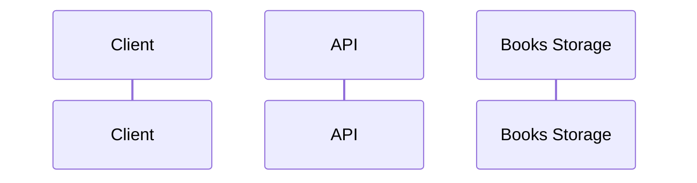

```mermaid
sequenceDiagram
    participant C as Client
    participant A as API
    participant DB as Books Storage

    %% TODO: Document the book checkout flow
    %% Add interactions between Client, API, and Books Storage
    %% Include error scenarios
    %% Show status codes and response payloads
```