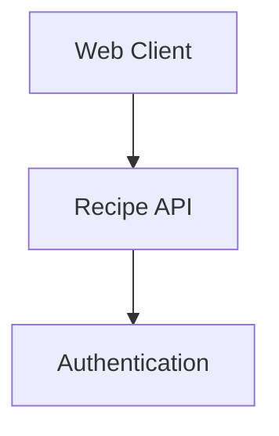

```mermaid
graph TB
    %% Recipe Management System Architecture
    %% During the demo, we'll document:
    %% 1. User interaction flow
    %% 2. Recipe storage and retrieval
    %% 3. Rating system
    %% 4. Search and filtering
    %% 5. Caching strategy

    %% Initial components
    Client[Web Client]
    API[Recipe API]
    Auth[Authentication]
    
    %% Basic flow
    Client --> API
    API --> Auth

    %% TODO during demo:
    %% - Add database components
    %% - Add caching layer
    %% - Add search service
    %% - Add rating service
    %% - Add image storage
    %% - Document data flows
    %% - Add monitoring
```