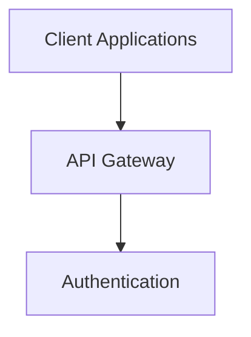

```mermaid
graph TB
    %% System Architecture Diagram Template
    %% During the demo, we'll document:
    %% 1. Main components and their relationships
    %% 2. Data flow between services
    %% 3. External integrations
    %% 4. Infrastructure elements

    %% Add components during demo
    Client[Client Applications]
    API[API Gateway]
    Auth[Authentication]
    
    %% Add relationships during demo
    Client --> API
    API --> Auth

    %% TODO during demo:
    %% - Add microservices
    %% - Add databases
    %% - Add message queues
    %% - Add caching layer
    %% - Add monitoring components
    %% - Document relationships
```